# Benutzerhandbuch – Hotel-Anwendung

Dieses Handbuch beschreibt die Bedienung der Hotel-Anwendung für zwei
Nutzerrollen:

- **Rezeption** – verwaltet Zimmer und Gäste, checkt Gäste ein und aus und
  sendet Nachrichten an Zimmer.
- **Gast** – liest die an das eigene Zimmer gesendeten Nachrichten und kann
  darauf antworten.

Die Bedienoberfläche der Anwendung ist auf Englisch. Die Beschriftungen von
Menüpunkten, Feldern und Schaltflächen werden in diesem Handbuch deshalb in
der Originalsprache in Anführungszeichen genannt.

---

## Teil 1: Für die Rezeption

### 1. Zimmer verwalten

1. Öffnen Sie im oberen Menü den Punkt **„Rooms"**.
2. Die Übersicht zeigt alle Zimmer mit Zimmernummer, Kategorie und aktuellem
   Belegungsstatus (**„Available"**, **„Occupied"** oder **„Cleaning"**).
   Die drei Kacheln oben fassen die Anzahl der Zimmer je Status zusammen.

   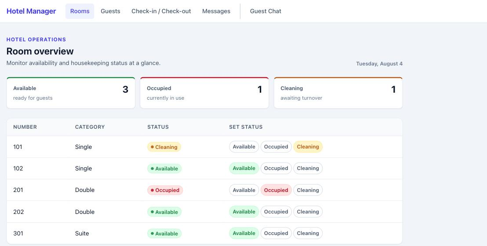

3. Um den Status eines Zimmers zu ändern, klicken Sie in der Zeile des
   Zimmers in der Spalte **„Set status"** auf den gewünschten Zielstatus
   (z. B. **„Available"**, nachdem die Reinigung abgeschlossen ist).
4. Die Anwendung bestätigt die Änderung mit einer grünen Hinweiszeile über
   der Tabelle.

   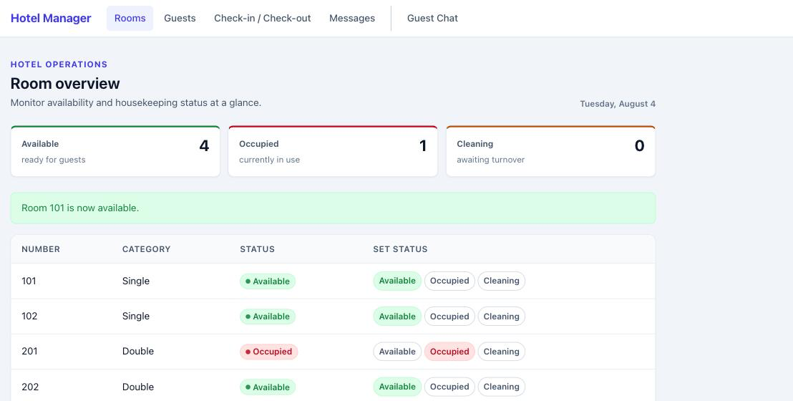

   Ein Zimmer, das gerade als **„Occupied"** geführt wird, kann nur auf
   **„Cleaning"** gesetzt werden; erst danach ist wieder **„Available"**
   auswählbar.

---

### 2. Gäste verwalten

1. Öffnen Sie im oberen Menü den Punkt **„Guests"**.
2. Um einen neuen Gast anzulegen, tragen Sie im Bereich **„Add Guest"**
   Vorname und Nachname ein und klicken Sie auf **„Add"**.

   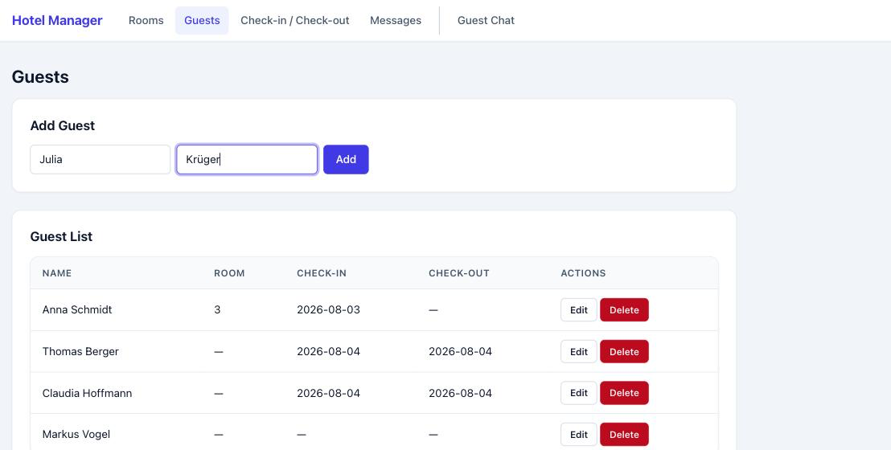

3. Der neue Gast erscheint danach unten in der **„Guest List"** zusammen mit
   allen bereits vorhandenen Gästen, deren zugewiesenem Zimmer sowie
   Check-in- und Check-out-Datum.

   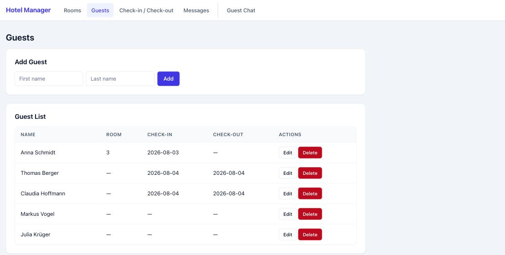

4. Um Vor- oder Nachnamen eines Gastes zu ändern, klicken Sie in der
   entsprechenden Zeile auf **„Edit"**, passen die Felder im Dialog an und
   bestätigen mit **„Save"**.

   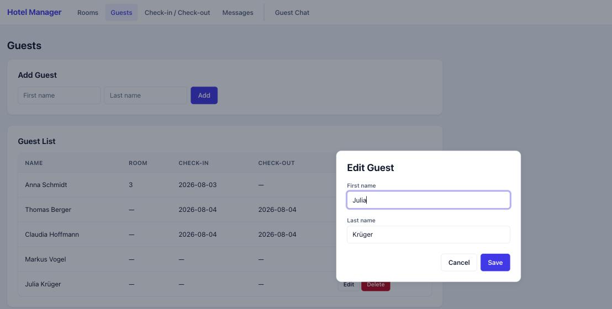

5. Um einen Gast zu löschen, klicken Sie in der entsprechenden Zeile auf
   **„Delete"** und bestätigen Sie die Sicherheitsabfrage des Browsers. Ein
   Gast mit aktuell zugewiesenem Zimmer kann nicht gelöscht werden; checken
   Sie ihn zuerst aus (siehe Abschnitt 4).

---

### 3. Gast einchecken (Check-in)

1. Öffnen Sie im oberen Menü den Punkt **„Check-in / Check-out"**.
2. Wählen Sie im Bereich **„Check-in"** links einen Gast ohne aktuelle
   Zimmerzuweisung und rechts ein verfügbares Zimmer aus.

   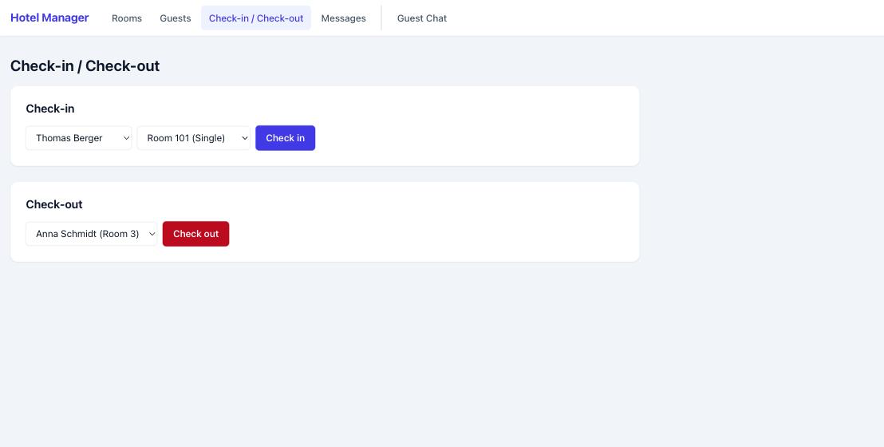

3. Klicken Sie auf **„Check in"**.
4. Die Anwendung bestätigt den Check-in, weist dem Gast das Zimmer zu,
   markiert das Zimmer als **„Occupied"** und speichert das
   Check-in-Datum.

   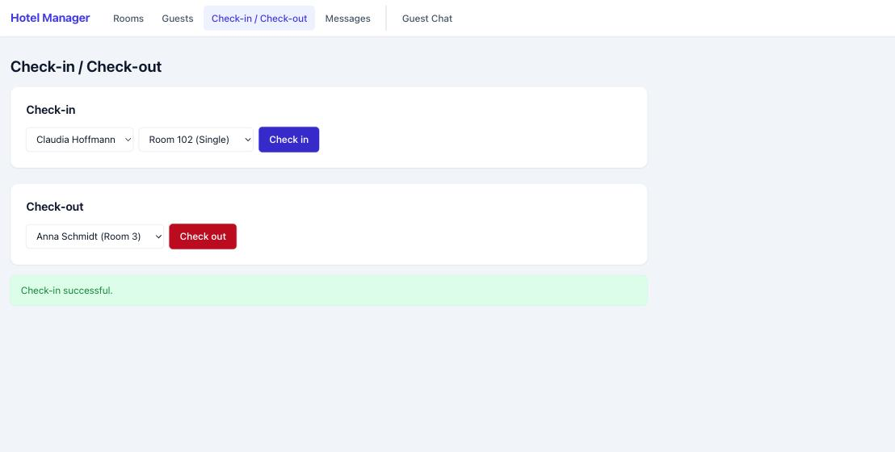

---

### 4. Gast auschecken (Check-out)

1. Öffnen Sie im oberen Menü den Punkt **„Check-in / Check-out"**.
2. Wählen Sie im Bereich **„Check-out"** einen aktuell eingecheckten Gast
   aus.

   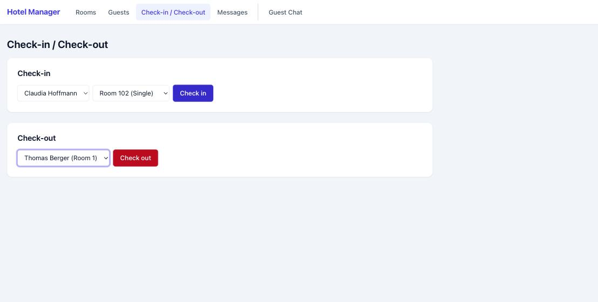

3. Klicken Sie auf **„Check out"**.
4. Die Anwendung entfernt die Zimmerzuweisung, speichert das
   Check-out-Datum und setzt das Zimmer auf **„Cleaning"**. Das Zimmer
   steht erst wieder zur Verfügung, nachdem es unter **„Rooms"** manuell auf
   **„Available"** gesetzt wurde (siehe Abschnitt 1).

   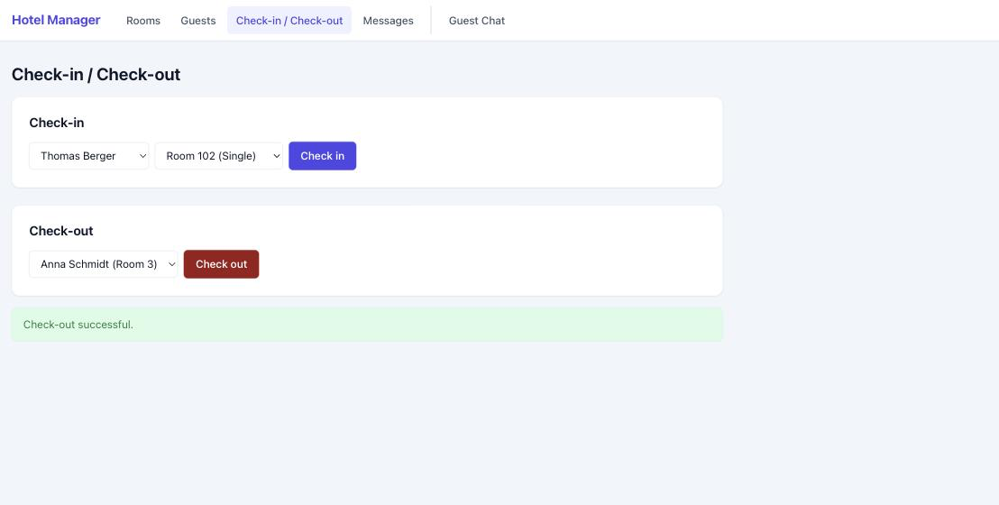

---

### 5. Nachricht an ein Zimmer senden

1. Öffnen Sie im oberen Menü den Punkt **„Messages"**.
2. Wählen Sie im Bereich **„Send Message"** das Zielzimmer aus, prüfen Sie
   das Feld **„Sender"** (voreingestellt mit **„Reception"**) und tragen Sie
   den Nachrichtentext in das Feld **„Message text"** ein.

   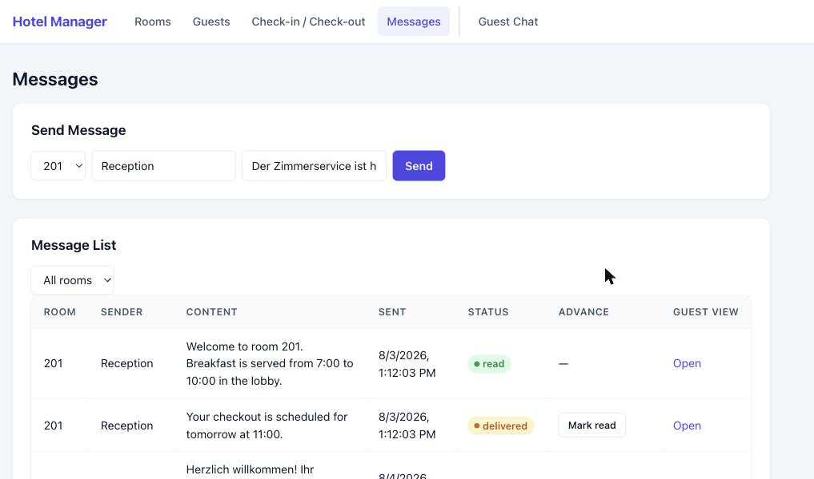

3. Klicken Sie auf **„Send"**.
4. Die Nachricht erscheint unten in der **„Message List"** mit Zielzimmer,
   Absender, Inhalt, Sendezeitpunkt und dem Status **„sent"**. Über die
   Spalte **„Advance"** kann der Status manuell auf **„delivered"** bzw.
   **„read"** weitergeschaltet werden; die Spalte **„Guest view"** öffnet
   die Nachrichtenansicht des jeweiligen Zimmers.

   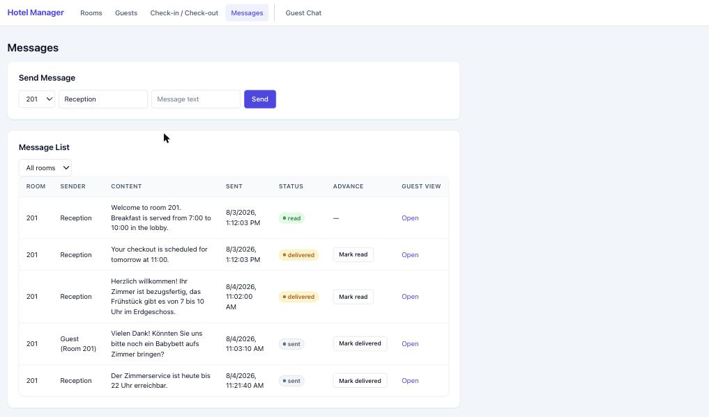

---

## Teil 2: Für Gäste

### 6. Nachrichten lesen und beantworten

Als Gast benötigen Sie keinen Zugang zur Rezeptionsoberfläche. Sie erreichen
den Nachrichtenverlauf Ihres Zimmers auf einem der folgenden zwei Wege:

- über einen Link, den Ihnen die Rezeption für Ihr Zimmer bereitstellt, oder
- indem Sie im oberen Menü auf **„Guest Chat"** klicken und dort Ihr Zimmer
  aus der Liste auswählen.

1. Klicken Sie auf **„Guest Chat"** und wählen Sie im Feld **„Room"** Ihr
   Zimmer aus, anschließend auf **„Open Chat"**.

   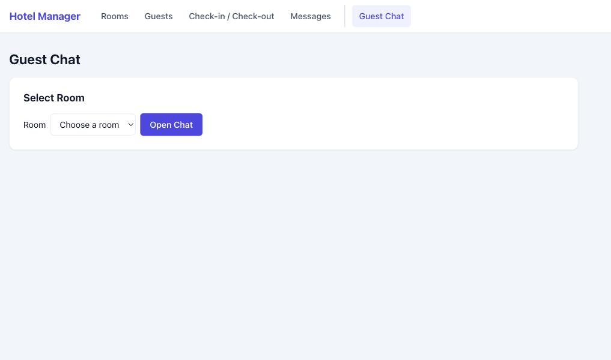

2. Es öffnet sich der Nachrichtenverlauf Ihres Zimmers mit allen bisher
   ausgetauschten Nachrichten, jeweils mit Absender, Inhalt, Zeitpunkt und
   Status.

   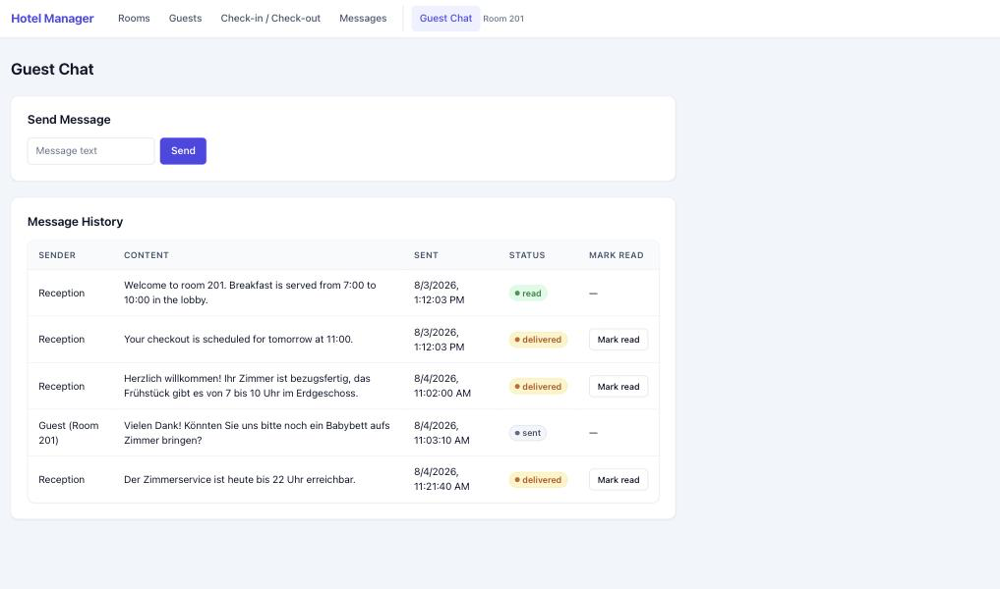

3. Um zu antworten, tragen Sie Ihren Text in das Feld **„Message text"** im
   Bereich **„Send Message"** ein und klicken Sie auf **„Send"**.

   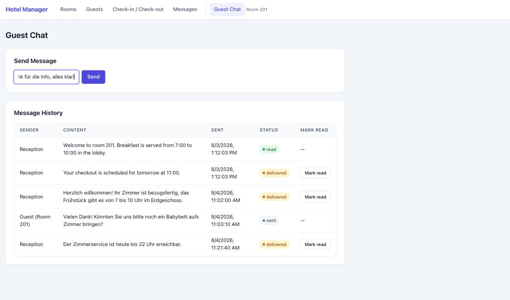

4. Ihre Antwort erscheint danach im Verlauf, gekennzeichnet mit dem Absender
   **„Guest (Room …)"**.

   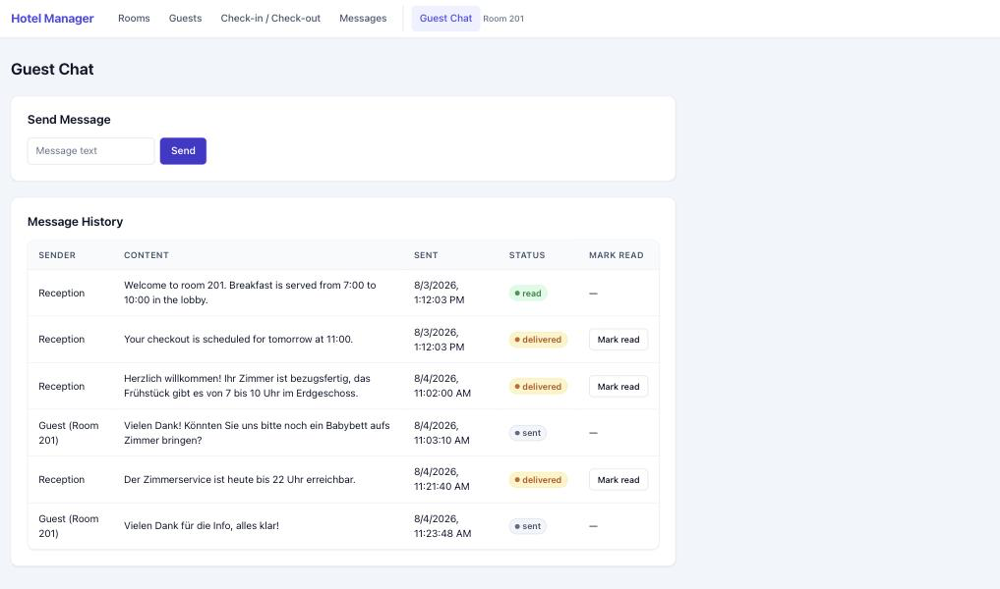

5. Sobald Sie eine Nachricht der Rezeption tatsächlich gelesen haben, können
   Sie dies in der entsprechenden Zeile über **„Mark read"** bestätigen. Der
   Status der Nachricht wechselt dadurch auf **„read"**, sodass die
   Rezeption erkennen kann, dass die Nachricht angekommen ist.

   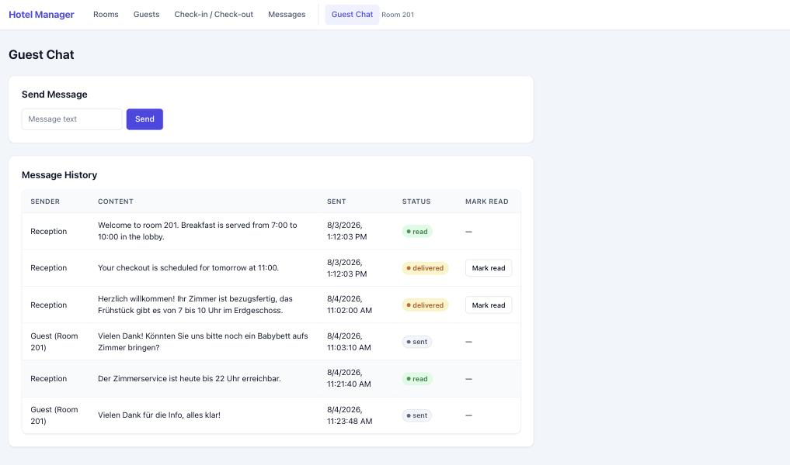
